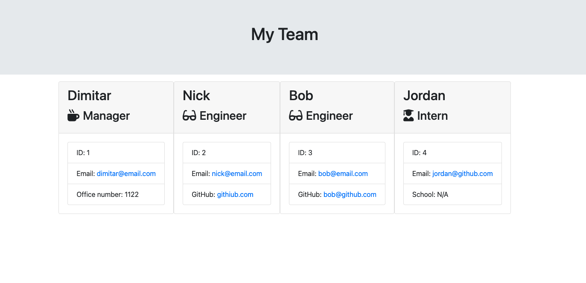

# Team Profile Generator

## Description

This Node.js command-line application allows a manager to generate a webpage displaying basic information about their software engineering team. The application takes in user input for team members, including managers, engineers, and interns. It creates HTML summaries for each team member and outputs the result to a file named `team.html`.

## User Story

As a manager, I want to generate a webpage that displays my team's basic info so that I have quick access to their emails and GitHub profiles.

## Instructions

1. **Classes and Tests**
   - Create classes for each team member provided and export them.
   - The tests for these classes (in the `_tests_` directory) must ALL pass.
   - The classes include:
     - `Employee` (parent class)
       - Properties: `name`, `id`, `email`
       - Methods: `getName()`, `getId()`, `getEmail()`, `getRole()`
     - `Manager` (extends `Employee`)
       - Additional properties: `officeNumber`
       - Overridden method: `getRole()`
     - `Engineer` (extends `Employee`)
       - Additional properties: `github`
       - Methods: `getGithub()`, `getRole()`
     - `Intern` (extends `Employee`)
       - Additional properties: `school`
       - Methods: `getSchool()`, `getRole()`
   - Optionally, add validation for user input.

2. **Inquirer Prompts and Object Creation**
   - Write code in `index.js` that uses inquirer to gather information about the development team members and creates objects for each team member using the correct classes as blueprints.
   - When the application starts, the user is prompted to enter the team manager's:
     - Name
     - Employee ID
     - Email address
     - Office number
   - The user is then presented with a menu with options to:
     - Add an engineer
     - Add an intern
     - Finish building the team
   - When the user selects the **engineer** option, they are prompted to enter details, and then taken back to the menu.
   - When the user selects the **intern** option, they are prompted to enter details, and then taken back to the menu.
   - When the user decides to finish building the team, they exit the application, and the HTML is generated.

3. **HTML Generation**
   - Call the `render` function (provided) and pass in an array containing all employee objects.
   - The `render` function generates and returns a block of HTML, including templated divs for each employee.

4. **HTML File Creation**
   - Create an HTML file using the HTML returned from the `render` function.
   - Write it to a file named `team.html` in the `output` folder.
   - You can use the provided variable `outputPath` to target this location.

## Getting Started

To install the necessary dependencies, run:

```bash
npm install

```
